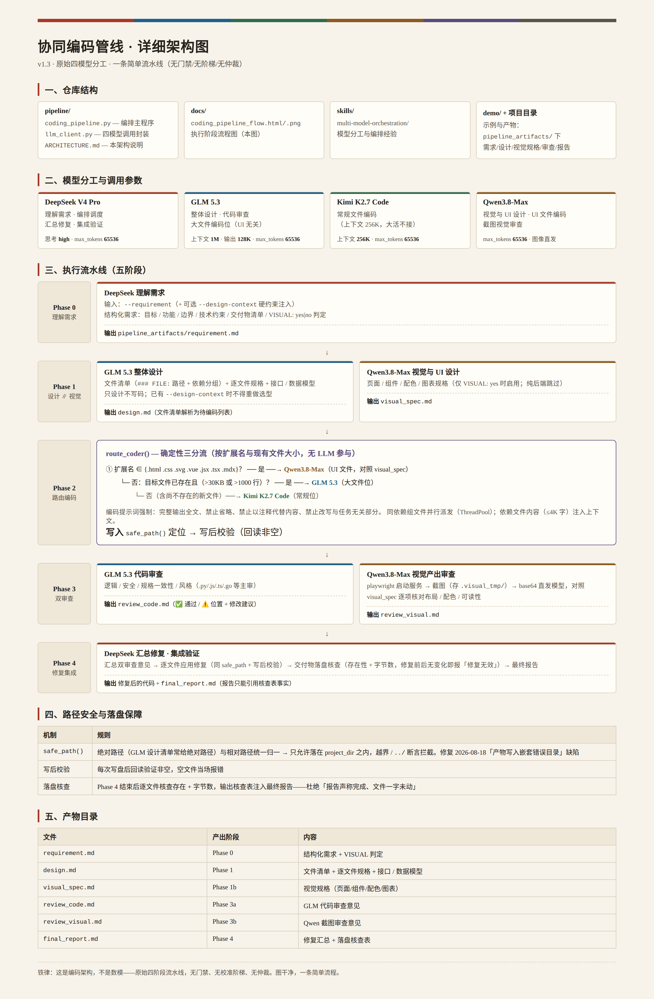

# Multi-agent Programming Pipeline

> **一句话：让四个大模型各干自己最擅长的事——但动手编码之前，永远先问清你的需求、调研开源方案、由你拍板技术选型、由你确认设计文档。**

这是一个**多模型协同编码管线**：不再让单个模型包办一切，而是把一次软件开发拆成「规划」和「执行」两段。规划段把决策权交给你（需求澄清 → 开源调研 → 技术选型 → 设计文档确认），执行段把四个环节交给四个不同模型家族的模型（设计 → 编码 → 审查 → 修复），最后交回一个验证过的成品。

## 完整工作流（用户定下的规矩）

```
① 先问清具体需求        编排者与你逐条澄清，产出确认版需求
② 搜开源项目架构        GitHub 搜索同类项目，汇总它们用的技术方案
③ 你选技术方案          候选方案逐个列出优点/缺点/适用场景/代表项目 → 你逐项拍板
④ 详细设计文档          基于确认需求 + 你的选型，产出架构设计文档 → 你确认
⑤ 按文档执行            确认后才交给四模型管线编码
```

**没有你的确认，编码一步都不会走。**

```
执行阶段四模型分工：
DeepSeek V4 Pro   理解需求 · 编排调度 · 汇总修复 · 集成验证
GLM 5.2           设计整体架构（文件清单+逐文件规格）· 代码审查
Kimi K2.7 Code    编写具体代码（逐文件）
Qwen3.8-Max       视觉与 UI 设计 · 视觉产出审查（截图级）
```

## 一张图看懂（执行阶段）



## 怎么工作的

**规划阶段**（`pipeline/planning.py`，每步停下等你决策）：

| 命令 | 做什么 | 产出 |
|---|---|---|
| （编排者）澄清需求 | 与你逐条确认目标/功能/边界 | `planning/requirements_confirmed.md` |
| `planning.py research` | GitHub 搜索开源项目 → 汇总技术架构 | `planning/research_notes.md` |
| `planning.py options` | 按维度列候选方案优缺点详解 | `planning/tech_options.md` + `choices.json` → **你选择** |
| `planning.py design` | 按你的选型出详细设计文档 | `planning/design_doc.md` → **你确认** |
| `planning.py build` | 调执行阶段开始编码 | 项目代码 |

**执行阶段**（`pipeline/coding_pipeline.py`，设计文档作为硬约束传入）：GLM 逐文件设计 ∥ Qwen 视觉规格 → Kimi 编码 → GLM∥Qwen 并行审查 → DeepSeek 修复集成。

## 快速开始

```bash
git clone git@github.com:xtr0928/Multi-agent-programming-pipeline.git
cd Multi-agent-programming-pipeline

# 配置四个模型的 API key（或写入 pipeline/.env，已 gitignore）
export DEEPSEEK_API_KEY=... GLM_API_KEY=... KIMI_API_KEY=... QWEN_API_KEY=...

# 完整流程：先规划（每步产物给用户确认），后执行
python3 pipeline/planning.py research --project-dir ./my_project --requirement "做一个xxx"
python3 pipeline/planning.py options  --project-dir ./my_project
python3 pipeline/planning.py design   --project-dir ./my_project
python3 pipeline/planning.py build    --project-dir ./my_project

# 跳过规划直接执行（仅限需求已非常明确的情况）
python3 pipeline/coding_pipeline.py --project-dir ./my_project --requirement "……"
```

> 什么时候**不**用管线：单文件小改、CRUD、用户催着要结果——直接自己写（solo）更快更省。

## 仓库结构

```
pipeline/
  planning.py                   # 规划阶段：调研/选型/设计文档（用户决策点）
  coding_pipeline.py            # 执行阶段：5 阶段编排
  llm_client.py                 # 四模型统一接口
  ARCHITECTURE.md               # 架构与技术要点详细文档（必读）
skills/
  multi-model-orchestration/    # 多模型编排方法论
  hermes-model-management/      # API key 验证/连接调试
docs/
  coding_pipeline_flow.png      # 执行阶段流程图
  pipelines-split-2026-08.md    # 三仓库分家说明
```

## 演进时间线

| tag | 里程碑 |
|---|---|
| `v1.0.0` | 多模型编排初版（DS 编排 / GLM 设计评审 / Kimi 编码分工） |
| `v1.1.0` | 接入 Qwen3.8-Max：长任务编码位（准入三测通过） |
| `v1.2.0` | 视觉/UI 全迁 Qwen3.8-Max（Kimi K3 视觉位退役，成本指令） |
| `main` | 可执行管线 + 规划阶段（需求澄清/开源调研/用户选型/设计确认） |

## 相关仓库

- 数模管线（MCM 竞赛解题）→ [Multi-agent-mathematical-modeling](https://github.com/xtr0928/Multi-agent-mathematical-modeling)
- 通用工具与编排 → [Multi-Agent](https://github.com/xtr0928/Multi-Agent)
